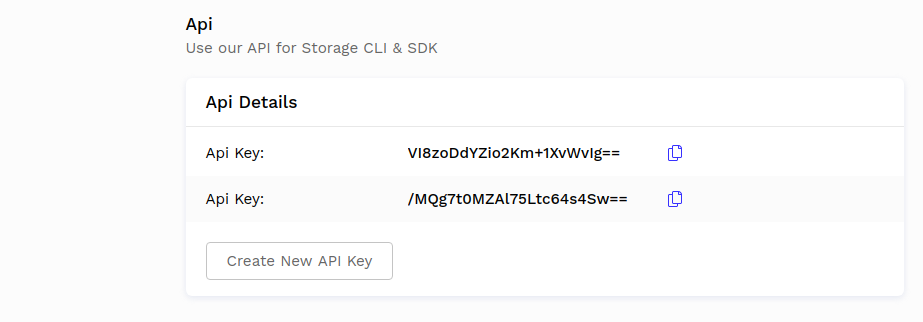

Fleek provides everything you need to securely store files on IPFS and distribute them for the web applications.

Our Storage SDK allows developers to easily integrate our storage solution through the widely used AWS S3 interface.

## Getting an API Key

### From the Web app

You can also generate a new api key from the Web app at [app.fleek.co](https://app.fleek.co).

The api generator is located in the user settings.


The new keys can be generated in the api section by clicking on `Create API keys`.
Make sense to copy the secret somewhere because it is only visible once.



## Creating an S3 Client
In order to use any of the SDK's command, we must generate an instance of the S3 client.

First, we must install the dependencies.

```sh
npm  init
```

```sh
npm install --save   aws-sdk
```

Then, we can declare the S3 client. You must replace [[apiKey]] and [[apiSecret]] with your [Api Key and Secret](/storage/storage-aws-s3-integration/#getting-an-api-key).

For [[endpoint]], you can either go for our shared gateway 'https://storageapi2.fleek.co' or use your bucket-specific URL 'https://[bucketName].s3.fleek.co/' (e.g.https://flk-team-bucket.s3.fleek.co/' ). The bucket option is still in alpha and might present issues for larger files.

```js
const AWS = require('aws-sdk');

const s3 = new AWS.S3({
  apiVersion: '2006-03-01',
  accessKeyId: '[[apiKey]]',
  secretAccessKey: '[[apiSecret]]',
  endpoint: '[[endpoint]]',
  region: 'us-east-1',
  s3ForcePathStyle: true
});
```

Commands can then be called from the S3 client. EG: `s3.putObject()`.

## Fetching Buckets
Buckets are the containers in which files are stored.

The buckets associated with your account can be listed programatically through your [S3 client instance](/storage/storage-aws-s3-integration/#creating-an-s3-client-instance).

```js
s3.listBuckets(function (err, data) {
  if (err) {
    console.log("Error when listing buckets", err);
  } else {
    console.log("Success when listing buckets", data);
  }
});
```

## Listing Files in a Bucket

Files in a bucket can be listed provided an [S3 client instance](/storage/storage-aws-s3-integration/#creating-an-s3-client) and a [bucket name](/storage/storage-aws-s3-integration/#fetching-buckets).

```js
const params = {
  Bucket: "my-bucket",
  MaxKeys: 20
};

s3.listObjectsV2(params, function (err, data) {
  if (err) {
    console.log("Error when listing objects", err);
  } else {
    console.log("Success when listing objects", data);
  }
});
```

An example of a typical response is provided below.

```
 { IsTruncated: false,
  Contents:
   [ { Key: 'hello-world.gif',
       LastModified: 2020-05-21T19:07:54.956Z,
       ETag: '"-1"',
       Size: 2078126,
       StorageClass: 'STANDARD',
       Owner: [Object] } ],
  Name: 'my-team-bucket',
  Prefix: '',
  Delimiter: '',
  MaxKeys: 20,
  CommonPrefixes: [],
  KeyCount: 1 }
```

Each file in Fleek Storage can be identified through the `Name` of the bucket that contains it and the file’s unique `Key`.

## Getting the public URL of a file

Fleek generates a public url for every file uploaded to Fleek Storage.

This url is derived from the name of the [bucket name](/storage/storage-aws-s3-integration/#fetching-buckets) and the [file's key](/storage/storage-aws-s3-integration/#listing-files-in-a-bucket) and is formatted as follows:

```sh
https://<bucket-name>.storage.fleek.co/<file-key>
```

## Uploading Files

You can upload files to a bucket with the `putObject` command through the [S3 Client](/storage/storage-aws-s3-integration/#creating-an-s3-client).
You must also specify the name of the [name of the bucket](/storage/storage-aws-s3-integration/#fetching-buckets) that will contain the file.

```js
const params = {
  Bucket: 'my-team-bucket',
  Key: 'folder/my-picture',
  ContentType: 'image/png',
  Body: myPictureFile,
  ACL: 'public-read',
};

const request = s3.putObject(params);
request.send();
```

The IPFS hash of the file can be accessed through the HTTP Headers of the request.

## Getting the IPFS Hash

Fleek Storage leverages the power of IPFS. As such, all files in Fleek Storage are on IPFS and have a corresponding IPFS hash, also called a CID.

Fleek will insert the ipfs hash of files in the http headers of the `putObject` command, used for [file upload](/storage/storage-aws-s3-integration/#uploading-files).

By default, we give a v1 base32 CID. However, users can also retrieve the v0 CID which is shorter and is therefore cheaper to store on public blockchains.

```js
const request = s3.putObject(params);

request.on('httpHeaders', (statusCode, headers) => {
  const ipfsHash = headers['x-fleek-ipfs-hash'];
  // Do stuff with ifps hash....
  const ipfsHashV0 = headers['x-fleek-ipfs-hash-v0'];
  // Do stuff with the short v0 ipfs hash... (appropriate for storing on blockchains)
}).send();
```

## Fetching File from Hash

Files stored in Fleek Storage can be fetched from any IPFS gateway with the IPFS hash, either from a web browser or through a CURL command.

From Fleek's IPFS gateway, the url is as follows: `http://ipfs.fleek.co/ipfs/<hash>`.

From the official IPFS gateway, the url is as follows: `https://ipfs.io/ipfs/<hash>`.

Beyond that, many companies offer IPFS gateways, such as [Cloudflare](https://developers.cloudflare.com/distributed-web/ipfs-gateway/) and [Infura](https://infura.io/docs/ipfs).

Of course, CURL commands will work as usual when fetching from a gateway.

```sh
curl https://ipfs.io/ipfs/Qmaisz6NMhDB51cCvNWa1GMS7LU1pAxdF4Ld6Ft9kZEP2a
```

Finally, files can be accessed without relying on third-party gateways through running an [IPFS node](https://github.com/ipfs/go-ipfs).

## Accessing Storage from Terminal

AWS also has tools for interacting with S3 from the terminal using AWS CLI. To do this, first install AWS CLI from https://aws.amazon.com/cli/

Then, configure the AWS CLI to point to Fleek Storage endpoint, replacing [[apiKey]] and [[apiSecret]] with the [Api Key and Secret](/storage/storage-aws-s3-integration/#getting-an-api-key).

```sh
aws configure
```

```sh
AWS Access Key ID [None]: [[apiKey]]
AWS Secret Access Key [None]: [[apiSecret]]
Default region name [None]: us-east-1
Default output format [None]: ENTER
```

To list your buckets, run the following command:

```sh
aws --endpoint-url https://storageapi2.fleek.co s3 ls
```

To list objects within a bucket, run:

```sh
aws --endpoint-url https://storageapi2.fleek.co s3 ls s3://my-bucket
```
Files are also available on a user's specific bucket url: `[bucketName].s3.fleek.co` (e.g.`https://flk-team-bucket.s3.fleek.co/filename` ). The bucket option is still in alpha and might present issues for larger files.